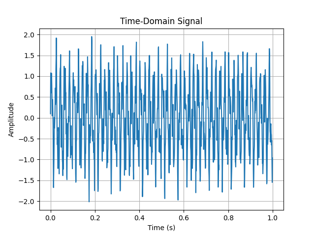
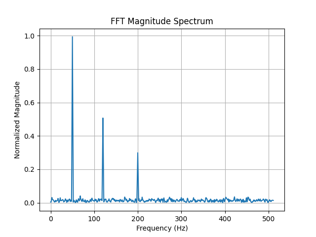

# Signal Processing Engine
*A modular C++ framework for learning and implementing digital signal processing algorithms.*

## Overview

The Signal Processing Engine is a modular C++ framework for simulating, analyzing, and processing noisy RF-like signals. It implements a full signal pipeline including signal generation, FFT-based spectral analysis, filtering, and frequency-domain feature detection.

The system is designed to emulate real-world signal processing workflows used in RF analysis, radar-like systems, and embedded sensor data interpretation.

---

## Current Features

- Simulates RF-like signals using configurable sine waves and additive noise
- Performs spectral analysis using both:
  - Direct Fourier Transform (DFT)
  - Recursive Cooley–Tukey Fast Fourier Transform (FFT)
- Applies a Hann window prior to frequency analysis
- Detects dominant frequency peaks
- Plots:
  - Time-domain waveform
  - Frequency spectrum
- Modular C++ architecture with separate signal generation, FFT processing, and plotting components

---

## Current Project Structure

```text
  SignalGenerator
        │
        ▼
  Sampled Signal
        │
        ▼
    Windowing
        │
        ▼
    DFT / FFT
        │
        ▼
Magnitude Spectrum
        │
        ▼
  Peak Detection
        │
        ▼
   Visualization
```
---

## Example Use Case

- Detecting dominant frequency components in noisy RF environments
- Simulating radar-like signal returns
- Analyzing interference and noise behavior in frequency space
- Evaluating filtering effectiveness using SNR comparisons

---

## Example Output

### Time-Domain Signal



### Frequency Spectrum



---

## Tech Stack

- C++
- Standard Template Library (STL)
- Linux (WSL / Ubuntu)
- CMake (optional build system)

---

## Current Learning Objectives

This repository documents my journey learning Digital Signal Processing (DSP) from first principles.

Topics explored include:

- Sampling theory
- Fourier Transform
- DFT vs FFT
- Window functions
- Spectral leakage
- Peak detection
- RF signal simulation

## Why I Built This Project

I built this project to deepen my understanding of Digital Signal Processing (DSP), frequency-domain analysis, and systems programming in C++.

The long-term goal is to evolve this project from simulated RF signals to real sensor inputs using microphones, Raspberry Pi hardware, and software-defined radios (RTL-SDR). These concepts are directly applicable to radar, RF communication, and embedded sensing systems.

---

## Roadmap

- FIR filtering
- IIR filtering
- CSV export
- Real microphone input
- Raspberry Pi ADC integration
- RTL-SDR support
- Spectrogram generation
- Performance benchmarking
- Real-time streaming FFT
- Target classification experiments

---

## Documentation

Additional engineering notes are available in the `docs/` directory.

- DSP Notes
- FFT Notes
- Experiment Log
- Project Journal

---

## Project Status

Active Development

Current Focus:
- Recursive Cooley–Tukey FFT
- DSP fundamentals
- Signal analysis
- Engineering documentation

---

## Repository Structure

Signal-Processing-Engine/
│
├── include/       Header files
├── src/           Source files
├── docs/          Engineering notes and experiments
├── plots/         Generated plots
├── README.md
├── Makefile
└── .gitignore
---

## Author

Built as a systems-level signal processing project focused on RF-style analysis and FFT-based feature extraction in C++.
