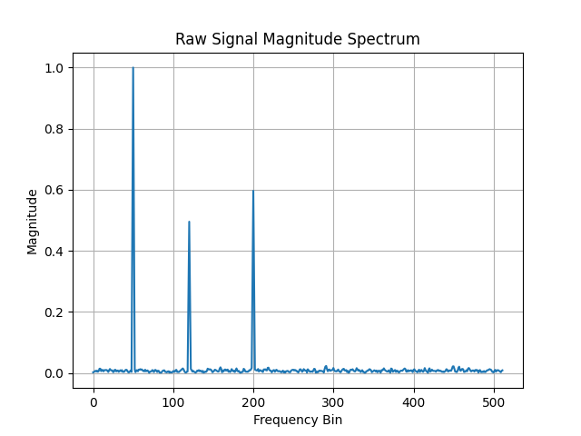
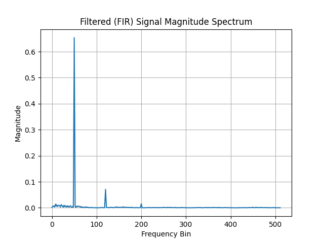
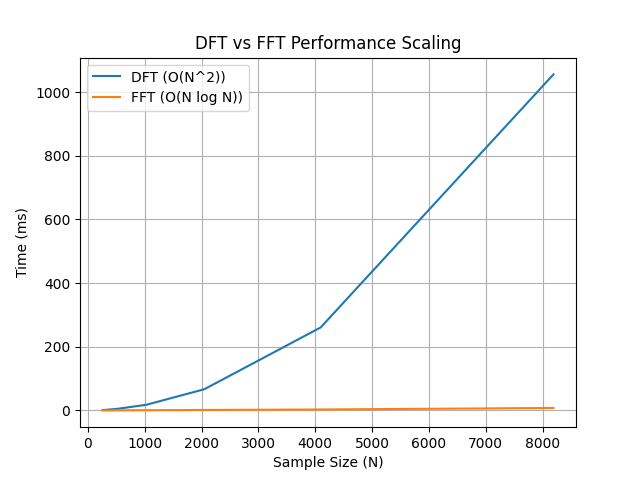
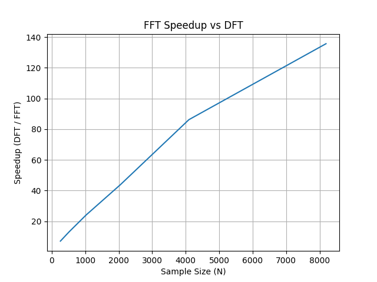

# Signal Processing Engine
*A modular C++ framework for learning and implementing digital signal processing algorithms.*

## Performance Analysis Included

This project includes a full benchmarking suite comparing:
- Direct Fourier Transform (DFT)
- Fast Fourier Transform (FFT)

Across multiple input sizes to demonstrate algorithmic scaling behavior.

## Overview

The Signal Processing Engine is a modular C++ digital signal processing (DSP) framework designed to simulate, analyze, and benchmark RF-like signals.

It implements a full end-to-end signal processing pipeline including signal generation, time-frequency analysis, spectral feature extraction, and performance benchmarking of Fourier transform algorithms.

The system is designed to emulate real-world DSP workflows used in RF analysis, radar systems, and embedded signal processing applications.

---

## Current Features

### Signal Generation
- Synthetic RF-like signal generation
- Configurable sine wave components
- Additive white Gaussian noise simulation

### Signal Processing
- Direct Fourier Transform (DFT) implementation (O(N²))
- Fast Fourier Transform (FFT) using Cooley–Tukey algorithm (O(N log N))
- Hann windowing to reduce spectral leakage


### Feature Extraction
- Magnitude spectrum computation
- Frequency bin mapping
- Peak detection of dominant frequency components

### Benchmarking System
- Automated performance benchmarking across multiple input sizes:
  - 256 → 8192 samples
- Repeated timing using high-resolution clock averaging
- Comparison of:
  - DFT execution time
  - FFT execution time
  - Speedup factor (DFT / FFT)

### Data Export & Visualization
- CSV export for:
  - Time-domain signals
  - Frequency spectra
  - Peak detection results
  - Benchmark results
- Python/plotting-ready data outputs
---

## Current Project Structure

```text
  SignalGenerator
        │
        ▼
  Sampled Signal
        │
        ▼
    Windowing
        │
        ▼
    DFT / FFT
        │
        ▼
Magnitude Spectrum
        │
        ▼
  Peak Detection
        │
        ▼
    CSVExporter
        |
        |
        ▼
   Visualization
```
---

### DSP Accuracy & Windowing Improvements

- Implemented Hann windowing for spectral leakage reduction
- Added coherent gain normalization for accurate amplitude scaling
- Fixed FFT/DFT magnitude scaling for physically meaningful frequency spectra
- Improved consistency between FFT and DFT outputs for validation

---
### Filtering

- Implemented FIR filtering (moving average filter)
- Applied preprocessing filter before frequency-domain analysis
- Enabled noise reduction prior to FFT-based spectral analysis

---

## Example Use Case

- Detecting dominant frequency components in noisy RF environments
- Simulating radar-like signal returns
- Analyzing interference and noise behavior in frequency space
- Evaluating filtering effectiveness using SNR comparisons

---

## Example Output

### Time-Domain Signal


### Frequency Spectrum


---

## Tech Stack

- C++
- Standard Template Library (STL)
- Linux (WSL / Ubuntu)
- CMake (optional build system)

---

## Benchmarking System
- Automated benchmarking across multiple signal sizes:
  - 256, 512, 1024, 2048, 4096, 8192 samples
- Repeated timing using high-resolution clock averaging
- Comparison of:
  - DFT execution time
  - FFT execution time
  - Speedup factor (DFT / FFT)

## Data Export
CSV export functionality for:
- Time-domain signal
- Frequency spectrum
- Peak detection results
- Benchmark performance results

---

## Benchmark Results (DFT vs FFT Performance Analysis)

This project benchmarks Direct Fourier Transform (DFT) against Fast Fourier Transform (FFT) across increasing input sizes to validate theoretical complexity differences.

### Results

| Sample Size | DFT (ms) | FFT (ms) | Speedup |
|-------------|----------|----------|----------|
| 256         | 1.07     | 0.15     | 7.0×     |
| 512         | 5.00     | 0.39     | 13.0×    |
| 1024        | 17.70    | 0.74     | 24.0×    |
| 2048        | 66.65    | 1.52     | 43.8×    |
| 4096        | 260.83   | 3.03     | 86.2×    |
| 8192        | 1055.45  | 7.78     | 135.7×   |

### Key Insight

- FFT vs DFT benchmarking validates O(N log N) vs O(N²) behavior
- Windowing significantly improves spectral clarity by reducing leakage
- Coherent gain normalization ensures accurate amplitude representation in frequency domain
- Filtering improves signal-to-noise ratio before spectral analysis, enabling clearer peak detection

This demonstrates the computational advantage of FFT for large-scale signal processing applications.
---

## FIR Filtering Comparisons

### Raw Signal Spectrum



### Filtered Signal Spectrum


## Benchmark Visualizations

### DFT vs FFT Timing



### FFT Speedup vs DFT



## Performance Summary

The benchmarking system measures execution time of DFT and FFT implementations across multiple signal sizes and computes a performance ratio:

Speedup = DFT Time / FFT Time

This provides a normalized measure of FFT efficiency compared to brute-force Fourier analysis.

The results consistently show increasing FFT advantage as signal size grows.

## Current Learning Objectives

This repository documents my journey learning Digital Signal Processing (DSP) from first principles.

Topics explored include:

- Sampling theory
- Fourier Transform
- DFT vs FFT
- Window functions
- Spectral leakage
- Peak detection
- RF signal simulation

## Why I Built This Project

I built this project to develop a deeper understanding of Digital Signal Processing (DSP), Fourier analysis, and systems-level performance engineering in C++.

The goal was not only to implement FFT and DFT algorithms, but to empirically validate their computational complexity through benchmarking.

This project bridges theoretical DSP concepts with practical performance analysis.

---

This project evolved from a basic FFT implementation into a full digital signal processing pipeline including filtering, windowing, and spectral analysis. It bridges theoretical DSP concepts with practical implementation in C++.

---

## Roadmap

### Signal Processing Enhancements
- FIR filtering implementation
- IIR filtering implementation
- Spectrogram generation
- Real-time FFT streaming

### Hardware Integration
- Raspberry Pi sensor input
- Microphone-based signal acquisition
- RTL-SDR RF signal capture

### Performance & Analysis
- Noise robustness (SNR testing)
- FFT optimization improvements
- Multi-threaded processing experiments

### Visualization
- Python-based analysis dashboard
- Enhanced performance plotting tools

---

## Documentation

Additional engineering notes are available in the `docs/` directory.

- DSP Notes
- FFT Notes
- Experiment Log
- Project Journal

---

## Project Status

Active Development

Current Focus:
- Recursive Cooley–Tukey FFT
- DSP fundamentals
- Signal analysis
- Engineering documentation

---

## Repository Structure

Signal-Processing-Engine/
│
├── include/       Header files
├── src/           Source files
├── docs/          Engineering notes and experiments
├── plots/         Generated plots
├── README.md
├── Makefile
└── .gitignore
---

## Author

Built as a systems-level signal processing project focused on RF-style analysis and FFT-based feature extraction in C++.
